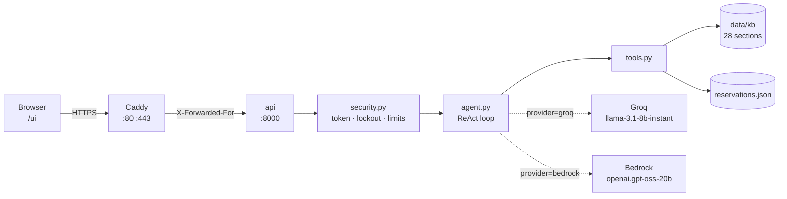
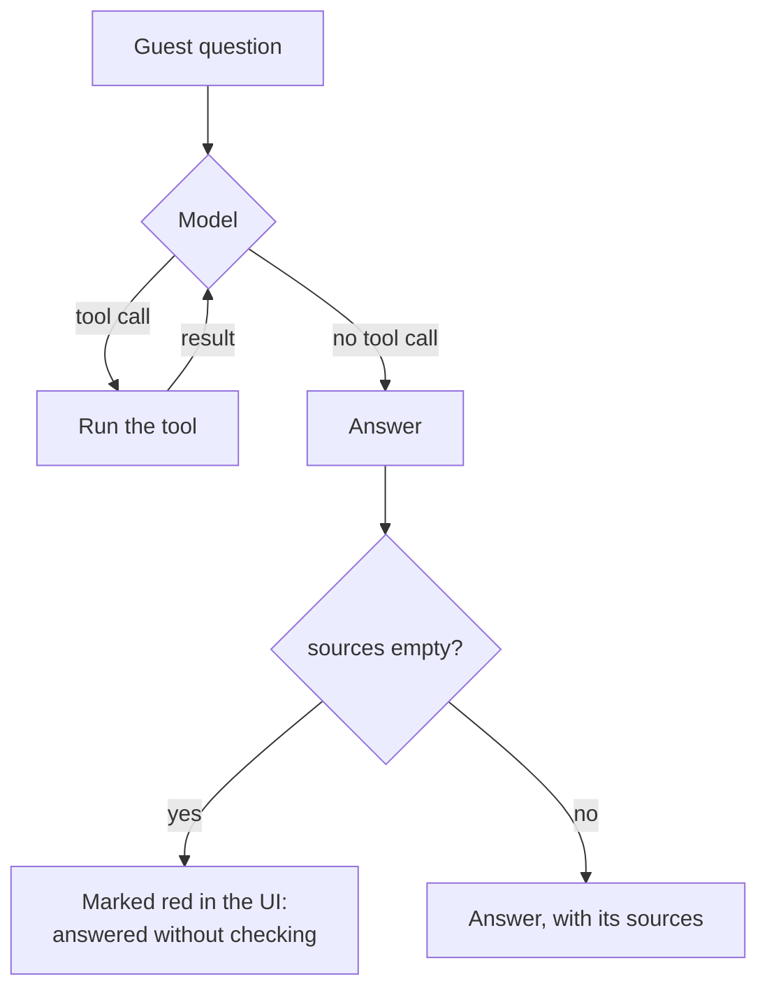
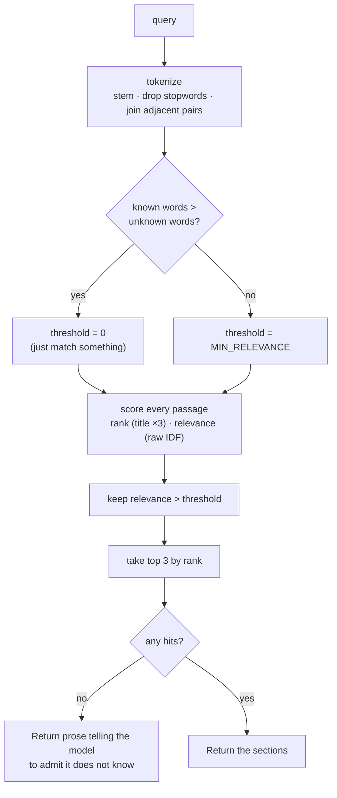
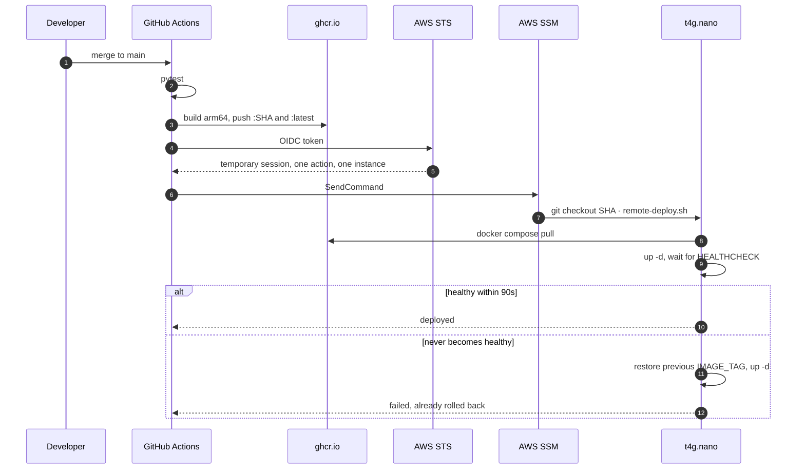
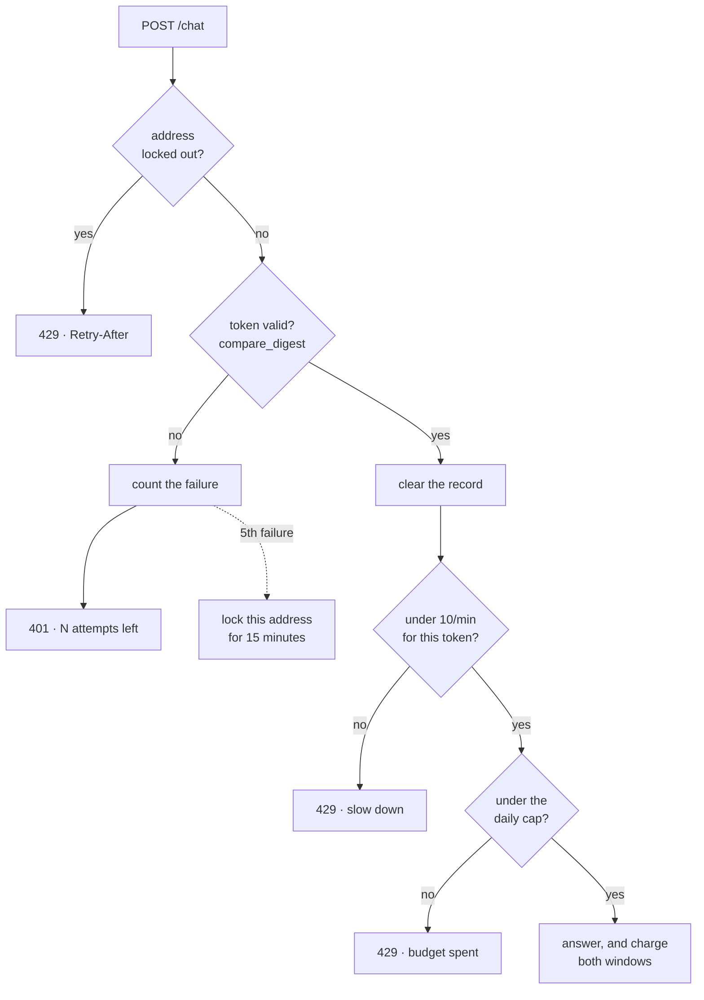

# Support Agent — build it, step by step

A guest support assistant for **Hotel Aurora**, a fictional 120-room hotel,
running 24/7 on a single AWS `t4g.nano` behind Caddy with automatic TLS, at
**[supportagent.lat](https://supportagent.lat)**.

This repository is the course material for the **Deployment** module of the AI
Engineering Fellowship. It is not a finished project you read — it is a finished
project you rebuild, in 26 numbered steps, from an empty machine to a deployed
agent that reports what every answer cost.

There is no toy environment. The host you provision in step 3 is the host the
agent lives on in step 26.

---

## How this repository works

Two copies of the same system. You work in one and consult the other.

```
support-agent/
│
├── README.md            ← you are here: the 26 steps
│
├── project/             ┐
├── deploy/              │  WORK AREAS — signatures, docstrings and TODOs.
├── infra/               │  Every blank is marked `STEP n` and points back
├── .github/workflows/   ┘  at a section of this file.
│
├── docs/                ← runbooks and architecture decisions. Complete:
│                          they are instructions, not exercises.
├── labs/                ← one lab per lecture, added with its slides
│
└── solution/            ← the finished system, every folder, explained
    ├── README.md
    ├── project/  deploy/  infra/  .github/workflows/
```

**Read `solution/` after you have tried, not before.** Every blank in the work
areas carries the reasoning you need in its docstring. The solution carries the
code. Reading the code first is faster and teaches you nothing, and you will not
be able to tell the difference until the first thing breaks in production.

### The loop

The test suite is written and it is failing. That is your progress bar.

```bash
cd project
python -m venv .venv && source .venv/bin/activate
pip install -r requirements-dev.txt
export GROQ_API_KEY=test-key-not-used API_TOKEN=test-token-not-real
pytest -q
```

The very first run is not 64 failures. It is four **collection errors**, all
saying the same thing:

```
app/config.py:77: in load_settings
    raise NotImplementedError("STEP 7.3 — see README §7")
```

`config.py` builds its settings at import, every module imports it, and so
nothing can even be collected until step 7 exists. Every blank names its step
that way. Work outward from the first one.

To find every blank still waiting for you:

```bash
grep -rn "STEP [0-9]" project deploy infra .github/workflows
```

And to see where you are against all 26 steps, including the ones no unit test
can reach:

```bash
python autograder/grade.py

# once you have a host and a domain, it grades those too
GRADE_BASE_URL=https://yourdomain.com GRADE_API_TOKEN=... python autograder/grade.py
```

The autograder runs three kinds of check — one that reads your files, one that
runs your code, and one that talks to your deployed API — and it says which kind
each result came from, because they are not equally good evidence.
[`autograder/README.md`](autograder/README.md) is worth five minutes before you
trust a green tick.

64 tests, four files:

| File | Covers | Steps |
|---|---|---|
| `tests/test_config.py` | settings, and quoted `.env` values | 7 |
| `tests/test_retrieval.py` | 35 retrieval cases, including the ones that must return nothing | 8–10 |
| `tests/test_security.py` | token, lockout, both rate limits, provider selection | 21–23 |
| `tests/test_trace.py` | the trace's shape, and cost for an unpriced model | 25–26 |

Nothing in the suite touches the network. `config.py` still demands both
variables at import, which is why they get placeholders above.

Steps that touch AWS, Docker or a browser have no unit test. Each one says how
to verify it by hand instead, and every one of those checks is something you
would want to run at 2am anyway.

### What you are given, and why

Three things are complete in the work areas, on purpose:

- **`project/app/data/`** — the 28-section knowledge base and five fake
  bookings. The retrieval thresholds in step 9 are calibrated against this exact
  corpus; rewriting it makes the tests meaningless. Read it, extend it later.
- **`project/app/static/index.html`** — the markup and the styling. Four
  JavaScript functions are blank, and they are the four that carry the lesson.
- **`project/tests/`** — the specification, in executable form.

---

## What you are building



One `t4g.nano`. **512 MiB of RAM**, of which Caddy takes ~25 MiB and the API
~72 MiB once the agent is loaded. That constraint is not a budget accident — it
is the exercise. It forces everything stateful off the instance and makes every
dependency a decision rather than a reflex.

Running cost, 24/7: **~$8.84/month**, of which the public IPv4 address costs more
than the instance.

| Component | USD/month |
|---|---|
| `t4g.nano` 24/7 (Ohio) | 3.07 |
| Public IPv4 address | 3.65 |
| EBS gp3, 15 GiB | 1.20 |
| Snapshots, traffic | ~0.92 |
| **Total** | **~8.84** |

---

## Before you start

- An **AWS account**. Everything here fits inside a few dollars a month, but it
  is not free tier — budget for it before you launch anything.
- A **domain** you control, or one you are willing to buy. TLS needs a real
  name; `nip.io` will not get you a Let's Encrypt certificate you can trust.
- A **[Groq API key](https://console.groq.com/keys)**. Free tier is enough for
  the whole module.
- **Python 3.12**, **Docker**, and the **AWS CLI**. `jq` too — the deploy
  scripts use it.
- A **GitHub account**, and a fork of this repository. Steps 16–20 write to it.

Bedrock is optional and arrives in step 25.

---

# Part I — The host

*Steps 1–6. At the end of this part you own a machine on the internet, with your
domain and a valid certificate, serving a container. There is no agent yet, and
that is deliberate: debugging DNS, the security group, the reverse proxy and TLS
at once through a single symptom — "the browser won't connect" — is a trap worth
not walking into.*

### 1. Fork the repository and get it running locally

**Build.** Fork on GitHub, clone your fork, and create the virtual environment
from *The loop* above. Confirm you get the collection error and not something
else — a different error here means Python 3.12 is not what you are running.

**Verify.** `python --version` says 3.12, and `pytest -q` stops with
`STEP 7.3 — see README §7`.

### 2. An account, a key pair, a security group

**Build.** In the AWS console, in **`us-east-2`** (or your own region — pick one
and stay in it, because a mismatched region is the cause of half the confusing
errors in part III):

- an EC2 **key pair**, downloaded and `chmod 600`;
- a **security group** allowing inbound **22**, **80** and **443**.

**Verify.** Nothing yet. Write the region down somewhere you will look again.

**Trap.** Port 80 is not optional and it is not for HTTP traffic. Caddy needs it
for the ACME HTTP-01 challenge. Close it and certificates silently never issue.

### 3. Provision the host from user-data

**Build** → `deploy/bootstrap.sh`

Launch a **`t4g.nano`**, Ubuntu 24.04 **arm64**, 15 GiB gp3, into that security
group, and paste the finished `bootstrap.sh` into the **User data** field.

Do not SSH in and run it by hand. The point of user-data is that the host is
reproducible from nothing — if you cannot destroy this instance and get an
identical one back, you do not have infrastructure, you have a pet.

The script's job, in order: wait for cloud-init and the apt lock; replace the
snap SSM agent with the `.deb` and purge snapd; 2 GB of swap; Docker and
`docker-compose-v2`; capped log driver; weekly pruning; and a sentinel file at
the very end.

**Verify.**

```bash
ssh -i key.pem ubuntu@<ip> 'cat /var/log/bootstrap-done.log; free -m; docker --version'
```

**Trap.** Ubuntu ships the SSM agent as a snap, and **snapd alone costs ~90 MiB
of RAM**. On 512 MiB that is the difference between fitting and not. Removing it
is the single highest-value line in the file.

**Trap.** The sentinel file is the only reliable way to tell a completed
bootstrap from one that died halfway. Without it you get an instance that comes
up looking healthy and behaves strangely, and no way to know which.

### 4. Point your domain at it

**Build.** An **A record** for the apex and for `www`, both at the instance's
public IPv4.

**Verify.** `dig +short yourdomain.com` returns the IP. Wait until it does
before step 5 — Let's Encrypt has a rate limit, and burning it on a domain that
does not resolve yet locks you out for a week.

### 5. Caddy, and a certificate you did not have to think about

**Build** → `deploy/Caddyfile`, `deploy/docker-compose.yml` (the `caddy` service)

Three lines of Caddyfile obtain and renew Let's Encrypt certificates on their
own, given the right domains, port 80, and somewhere for the certificates to
live across restarts.

**Verify.** After `docker compose up -d`:

```bash
curl -sI https://yourdomain.com | head -1
echo | openssl s_client -connect yourdomain.com:443 2>/dev/null | openssl x509 -noout -dates
```

**Trap.** The named volume on `/data` is the whole ballgame. Without it, every
restart requests a fresh certificate, and Let's Encrypt's rate limit is per week,
not per hour.

### 6. The first container

**Build** → `deploy/docker-compose.yml` (the `api` service), `deploy/.env.example`

Add the api service. Two decisions in it outlive this step:

- **`expose`, not `ports`.** Publishing the API's port would put it on the
  public internet beside Caddy. Step 22 trusts `X-Forwarded-For` precisely
  because that cannot happen.
- **no `container_name`, on either service.** Docker container names are
  **global**, not scoped to the compose project. A stack left running from an
  earlier lecture owns the name `api`, and every deploy after it dies on a
  conflict. Compose generates `deploy-api-1` and the services still address each
  other by service name.

**Verify.** `curl https://yourdomain.com/health` returns JSON over TLS.

---

# Part II — The agent

*Steps 7–15. A ReAct agent over two tools, and the thing it is built not to do:
answer from memory.*



### 7. Settings that fail at import

**Build** → `project/app/config.py`

A frozen dataclass, populated from `os.environ` once, at import. Two variables
are required; everything else has a default.

Missing configuration has to fail **here**, not on the first request. A
container that starts and only breaks when a guest talks to it is worse than one
that never starts: the healthcheck goes green and the deploy looks successful.

Two of the defaults are decisions rather than conveniences:

- `GROQ_MODEL` defaults to the **small** model, `llama-3.1-8b-instant`. Step 14
  explains why the impressive one lost.
- `BEDROCK_MODEL_ID` has **no default at all**. Step 25 explains why a shipped
  default would be wrong for most accounts, and wrong only at the first question.

**Verify.** `pytest tests/test_config.py`

**Trap.** `_clean()` exists because Compose's `env_file` is not a shell.
`API_TOKEN="abc"` there gives you a value with the quote marks still in it, and
the only symptom is a login that will not work for a reason nothing reports —
you cannot print the secret to compare it. Quoting values in a `.env` is a habit
people bring from shell scripts; accept it rather than punishing it.

### 8. The knowledge base

**Build** → `project/app/tools.py` (`_load_passages`)

The corpus is given to you: seven Markdown files, 28 `##` sections. You write
the loader.

Sections are the right unit of retrieval — small enough that a match is
specific, large enough to answer a question on their own without stitching
fragments back together. Choose paragraphs and you return half an answer; choose
files and every query matches everything.

Raise if the corpus is empty. An agent silently retrieving from nothing looks
exactly like an agent answering from memory.

**Verify.** `python -c "from app.tools import PASSAGES; print(len(PASSAGES))"` → 28

### 9. Retrieval that knows when to say nothing

**Build** → `project/app/tools.py` (`_normalize`, `_tokenize`, `_build_idf`,
`_score`, `MIN_RELEVANCE`, `search_hotel_policies`)

This is the longest step and the one worth the most.



Four ideas stack up here, and each one exists because the previous one failed on
a real query:

**Term overlap alone is not enough.** "Do you offer babysitting?" matches the
room service section, because both contain the word "service". A model handed an
irrelevant-but-plausible passage answers from it. Weighting terms by how rare
they are in the corpus — IDF — separates a real match from a coincidental one:
"service" appears all over the documentation and carries almost no signal,
"vegan" appears once and carries all of it.

**Rank and relevance are two numbers, not one.** A section titled "Pets" is
about pets in a way a passing mention is not, so a title match is worth 3× for
ordering. But if that boost also fed the threshold, "babysitting service" would
clear it purely by matching the word "services" in a heading.

**Stemming, badly, on purpose.** A guest asks about smoking on the balcony; the
documentation says "smoking" and "balconies". Strip one suffix with a
three-character minimum stem. The stems are wrong — "policy" becomes "polic" —
and it does not matter, because the same rule runs over the query and over the
corpus. Wrong-but-identical is all it needs to be. Proper stemming is a
dependency; this is four lines.

**A fixed floor cannot work, and finding out why is the point.** Two queries
force the rule:

| Query | Should return | Why it is hard |
|---|---|---|
| `pool hours` | the pool section | the corpus never uses the word "hours" — it says "open daily from 07:00 to 21:00" — so only one moderately common term matches |
| `babysitting service` | nothing | "service" is common enough to score just as well |

`pool` and `service` both appear in four sections and score **identically,
1.89**. No threshold separates them. What does is the *balance* of known to
unknown words: two of the three words in the first query are vocabulary the
documentation uses, against one of two in the second. A word appearing nowhere
in the corpus is the strongest evidence there is that the guest is asking about
something the hotel does not document.

**Verify.** `pytest tests/test_retrieval.py` — 35 cases, and the ones asserting
that a query returns *nothing* are the ones that matter.

**Trap.** Filter by relevance **before** truncating to three results. Filter
after and a relevant passage ranked fourth is dropped behind three that fell
below the floor.

**Trap.** No hits is a result, not an error. Return prose telling the model to
admit ignorance and offer a human. Return an empty string and the model fills
the silence itself.

### 10. Exact lookup, which fails differently

**Build** → `project/app/tools.py` (`_load_reservations`, `get_reservation`)

The second tool is deliberately the opposite kind. `search_hotel_policies` is
fuzzy and returns prose to interpret; `get_reservation` is exact and returns
structured fields or nothing.

They fail differently, and a real support agent mixes both. The first can return
something irrelevant. The second returns nothing — and the model must not invent
a booking to fill the gap, which is why a miss returns a sentence saying so
rather than `None`.

**Verify.** `pytest tests/test_retrieval.py -k reservation`

### 11. The system prompt

**Build** → `project/app/agent.py` (`SYSTEM_PROMPT`)

**Nothing about the hotel goes in the prompt.** No opening hours, no pet fee, no
phone number the documentation does not already carry. The moment a fact lives
in the prompt, the agent answers from it without calling anything, and the
retrieval you just built becomes decoration that drifts from the documentation
the first time either changes.

Five rules, and each earns its place: which tool covers what; call a tool before
answering *anything* about the hotel, including check-out time; say plainly when
the tools return nothing and offer a human; state the limits of its authority —
it cannot take payment or change a booking; reply in the guest's language but
query the tools in English, because the documentation and the retrieval are
monolingual.

Write instructions, not description. "Do not answer from memory" is a rule; "you
are a helpful assistant" is a mood.

**Verify.** No test. Step 13 is where you ask it something and read the
`sources` list.

### 12. The ReAct loop

**Build** → `project/app/agent.py` (`build_agent`, `_agent_for`)

`create_agent` from LangChain, the tools from step 9 and 10, the prompt from
step 11. Cache the compiled graph — compiling is not free — but key the cache on
the **model as well as the provider**, or changing the configured model silently
keeps serving the agent built from the old one.

`_agent_for` raises `ValueError`, not an HTTP error. Keeping the HTTP vocabulary
out of this module is what lets it be called from a test, a script or a stream.

**Trap.** `langgraph.prebuilt.create_react_agent` is deprecated. Use
`langchain.agents.create_agent`.

### 13. `/health` and `/chat`

**Build** → `project/app/main.py` (`health`, `chat`)

The request and response models are given — they are the contract, and arguing
about field names is not the lesson.

`/health` must stay cheap and unauthenticated. It is hit every 30 seconds
forever, it is what the container healthcheck runs, and it is what the deploy's
health gate reads in step 19. A healthcheck that needs a secret is a healthcheck
that fails for the wrong reasons.

`/chat` uses `ainvoke` — the blocking path — and returns the reply with its
`sources`.

**Verify.**

```bash
uvicorn app.main:app --reload
curl -X POST localhost:8000/chat -H 'content-type: application/json' \
  -H "Authorization: Bearer $API_TOKEN" \
  -d '{"messages":[{"role":"user","content":"Can I bring my dog?"}]}' | jq
```

Read `sources`. An **empty list means the agent answered without checking
anything**, which your prompt forbids. That is the failure this whole project is
about, and this is the first place you can see it.

Interactive documentation is at `/docs`, free from FastAPI.

### 14. Streaming, and the failure that has no status code

**Build** → `project/app/agent.py` (`stream`), `project/app/main.py`
(`chat_stream`), `project/app/static/index.html` (`ask`)

Server-sent events: `{"token": …}` while the reply is written, then
`{"sources": …}`, then `{"trace": …}`, then `{"done": true}`.

Two modes off `astream` and you need both. `"messages"` gives token chunks — and
a chunk carrying a tool call is the model *deciding*, not *answering*, so it
must never reach the guest. `"updates"` gives whole graph nodes, which is the
right granularity for the trace in step 26.

**The part people get wrong.** The 200 and its headers leave before the first
token does. Before that moment, a bad provider can still be a 400 — so resolve
the provider *before* opening the response. After it, nothing can be a status
code: an exception inside the generator just ends the stream, and every cause —
an invalid model id, a revoked credential, a provider outage — reaches the
browser looking identical to a dropped connection. Yield an explicit
`{"error": …}` event and let the page say what actually happened.

**Verify.**

```bash
curl -N -X POST localhost:8000/chat/stream -H 'content-type: application/json' \
  -H "Authorization: Bearer $API_TOKEN" \
  -d '{"messages":[{"role":"user","content":"What time is check-out?"}]}'
```

Then break it on purpose: set `BEDROCK_MODEL_ID` to something that does not
exist and ask again. You should get a sentence naming the problem, not silence.

**Trap.** Set `X-Accel-Buffering: no` on the response, or a proxy buffers the
whole stream and delivers it at once — which is indistinguishable from a slow
model.

**Trap, and this is a measurement rather than an opinion.** Model quality and
tool-calling reliability are different things, and only an end-to-end call on
the transport you actually ship tells them apart. `llama-3.3-70b-versatile`
emits `<function=search_hotel_policies {...}</function>` instead of a JSON tool
call and Groq rejects it with `tool_use_failed` on about half of requests.
`openai/gpt-oss-120b` answers well but fails tool calls roughly a third of the
time **over streaming specifically** — which is the path the browser uses.
`llama-3.1-8b-instant` completed 7 of 7 across both paths at about **$0.0001 per
exchange**, well under a second. The small model won on the only axis that
matters.

### 15. The image

**Build** → `project/Dockerfile`

Multi-stage, non-root, healthcheck. `--workers 1`, and that is not a performance
knob: every counter in step 22 and 23 lives in this process's memory, so two
workers means two independent sets of counters and limits that are silently
double what they claim.

**Verify.**

```bash
cd project && docker build -t support-agent .
docker run --rm -p 8000:8000 --env-file .env support-agent
docker stats --no-stream
```

**Trap.** The `HEALTHCHECK` spikes memory by **10 MiB every 30 seconds**, because
`python -c ...` starts a second interpreter inside the container's cgroup.
Baseline 69.8 MiB, peak 80.2 MiB. Harmless under `mem_limit: 192m`, and worth
knowing before you mistake it for a leak.

**The memory budget**, measured on the host rather than estimated:

| Container | after part I | after part II | after part IV |
|---|---|---|---|
| caddy | ~25 MiB | ~25 MiB | ~25 MiB |
| api | ~33 MiB | ~70 MiB | **~72 MiB** |

The agent cost 37 MiB, almost all of it LangChain and LangGraph at import.
Authentication, the rate limiter and the entire browser interface cost 2 MiB
between them.

Consequences, which are rules and not suggestions: **no local embeddings** — no
`sentence-transformers`, no `torch`, embedding is a network call. **No local
vector store, no local database.** **The container is stateless**, and can be
killed and recreated at any moment, which is precisely what a deploy does. Pin
every dependency: `pip` resolving a different version on the host than on your
laptop is a class of failure that only shows up at 512 MiB.

But **measure before excluding a package.** This project used to forbid the
`langchain` meta-package on the grounds that it drags in hundreds of MiB of
integrations. That was true of LangChain 0.x. In 1.x the integrations moved to
`langchain-classic`, and `langchain` on top of `langgraph` and `langchain-groq`
measures **~1 MB**. The rule outlived its reason by a major version, and
`pip install` plus `du -sh` settled it in under a minute.

---

# Part III — Continuous deployment

*Steps 16–20. Merging to `main` reaches the host on its own, with no SSH key, no
long-lived AWS credential and port 22 closed.*



Every failure in this part happens **in the joints between systems** — never in
the code. Expect that, and read the errors as boundary problems rather than
bugs.

### 16. GitHub OIDC → AWS

**Build** → `infra/setup-github-oidc.sh`

An IAM OIDC provider, a role GitHub Actions can assume, and a policy permitting
exactly `ssm:SendCommand` against **one** instance ARN. Not `*`. The entire
argument for OIDC over an SSH key is that the credential is scoped and
short-lived, and a wildcard gives that back.

Then, in your repository settings, three **Variables** (not secrets — none of
these is one): `AWS_ROLE_ARN`, `AWS_REGION`, `EC2_INSTANCE_ID`.

**Verify.** Run the workflow and watch the credentials step succeed.

**Trap — budget an afternoon if you meet it cold.** GitHub issues the token with
an **immutable subject claim** carrying numeric IDs:

```
repo:OWNER@ownerID/NAME@repoID:ref:refs/heads/main
```

while every tutorial shows the classic form:

```
repo:OWNER/NAME:ref:refs/heads/main
```

A trust policy matching only the classic form fails with *"Not authorized to
perform sts:AssumeRoleWithWebIdentity"* and says nothing about why. **Allow both
forms.** Rather than guessing, decode what your own repository actually sends:

```yaml
- run: |
    curl -sH "Authorization: Bearer $ACTIONS_ID_TOKEN_REQUEST_TOKEN" \
      "$ACTIONS_ID_TOKEN_REQUEST_URL&audience=sts.amazonaws.com" \
      | jq -r .value | cut -d. -f2 | base64 -d 2>/dev/null | jq .sub
```

**Trap.** Do **not** add `environment:` to the deploy job. It rewrites the
subject to `repo:OWNER/NAME:environment:NAME` and the trust policy stops
matching. Keeping the branch as the boundary means one place decides who may
deploy.

### 17. The instance profile

**Build** → `infra/attach-ssm-profile.sh`

The symptom: the deploy authenticates fine and dies with `InvalidInstanceId —
Instances not in a valid state for account`. The instance is running. The agent
is running. Nothing in the message says what is wrong.

What is wrong is that the instance has no way to prove who it is. EC2
authenticates to SSM using credentials from its **instance profile**, and an
instance launched without one has `IamInstanceProfile: null`. The agent starts,
finds nothing to authenticate with, and never registers — so
`describe-instance-information` returns an empty list, which reads exactly like
the agent not being installed.

**A role and an instance profile are two different objects.** EC2 attaches
profiles, not roles. A role with the right policy and no profile wrapping it is
invisible to the instance. That distinction is the whole step.

**Verify.**

```bash
aws ssm describe-instance-information --region us-east-2 \
  --query 'InstanceInformationList[].[InstanceId,PingStatus]' --output text
```

`Online` within a minute or two. No stop or restart is needed —
`associate-iam-instance-profile` works on a running instance.

### 18. Build the image in CI

**Build** → `.github/workflows/deploy.yml` (the `test` and `build` jobs)

`runs-on: ubuntu-24.04-arm`, because the host is Graviton. Building arm64 on an
x86 runner under QEMU works and takes roughly ten times as long.

Tag with **both** the commit SHA and `latest`. The SHA is what gets deployed;
`latest` is for humans reading the registry. Deploying a moving tag leaves a
rollback with no fixed point to return to.

Add `paths` filters, so editing a lab or a runbook does not restart production,
and a `concurrency` group, because two SSM commands rewriting the same `.env`
and racing `docker compose up` is how a host ends up serving an image nobody
chose.

**Verify.** The image appears in your repository's Packages. **Make the package
public**, or the host cannot pull it.

**Trap.** ghcr rejects a repository name containing capitals, and
`github.repository` gives you the owner's name verbatim. Lowercase it:
`ghcr.io/${GITHUB_REPOSITORY,,}`.

**Trap.** Re-running a workflow rebuilds and re-pushes tags that already exist,
and ghcr answers a burst of those with a **secondary rate limit** — a 403 that
reads exactly like a permissions problem and is not one. Check whether the
manifest is already there and skip the build. A commit maps to exactly one image.

### 19. Roll out over SSM, with a health gate

**Build** → `deploy/host-setup.sh`, `deploy/remote-deploy.sh`,
`.github/workflows/deploy.yml` (the `deploy` job)

Run `host-setup.sh` once on the instance. Then the workflow sends one SSM
command: check out the SHA, run `remote-deploy.sh`.

`remote-deploy.sh` is the interesting file. It reads the current `IMAGE_TAG`
**before** overwriting it — that value is the only thing that makes a rollback
possible — pulls, brings the stack up, and waits on the container's own
`HEALTHCHECK`. If it does not go healthy in 90 seconds, it restores the previous
tag, brings that back up, and exits non-zero.

**Verify.** Merge something trivial under `project/`. Then exercise the failure
paths against a **local registry** before trusting this: a successful rollout, an
image that cannot be pulled, and an image that starts but never becomes healthy.
The last one is the reason the rollback exists and the one that never gets tested
until it is needed.

**Trap.** `AWS-RunShellScript` runs your commands with `/bin/sh`, which on Ubuntu
is dash. `set -o pipefail` is a bashism and aborts the entire script with
*"Illegal option"*. Use `set -eu` in the inline commands and put anything needing
bash in `remote-deploy.sh`, invoked with bash on purpose.

**Trap.** Deploys arrive over SSM as **root**, while the checkout belongs to
`ubuntu`. Git refuses to operate across that boundary — *"detected dubious
ownership"* — and the deploy fails before doing anything. `git config --system
--add safe.directory /opt/support-agent`.

**Trap.** `docker compose restart` does **not** re-read `env_file`. Environment
is resolved when a container is *created*, so a changed `.env` needs
`up -d`. This one costs people an hour every time they meet it.

**Trap.** Ask compose which container belongs to the project —
`docker compose ps -q --status running api` — rather than inspecting one called
`api`. Names are global, so you may be inspecting a container from an earlier
lecture, or one with no healthcheck at all, which looks identical to a deploy
that never came up.

### 20. Rollback

**Build** → `.github/workflows/rollback.yml`

Redeploy an earlier SHA on demand, after confirming that image still exists in
the registry — rolling back to a tag that was never built leaves production down
and the operator out of ideas.

Share the `concurrency` group with the deploy workflow. Say in the run summary
that `main` still points somewhere else and a revert PR is still owed: a rollback
that leaves no trace is how a repository and its production host quietly stop
agreeing.

**Deliberately absent** from this part: **no staging environment, and no smoke
test of the agent itself.** The healthcheck proves the process is up and serving
`/health`, not that it answers a guest correctly. An image with a broken system
prompt deploys green. Closing that needs an evaluation suite, which is a later
module's subject — and naming the gap is more honest than a passing test suite
would be.

---

# Part IV — A door, a lock, and a meter

*Steps 21–24. The agent is reachable by anyone who knows the URL, and every
request spends money. This part closes both, and gives the thing a face.*



### 21. A shared bearer token

**Build** → `project/app/security.py` (`_bearer_token`, `require_token`)

One secret, compared with `compare_digest`. Not `==`: string equality returns
early at the first differing byte, and the time it takes leaks the prefix.

**Verify.** `pytest tests/test_security.py -k token`

### 22. Five wrong tokens lock the address

**Build** → `project/app/security.py` (`client_address`, `check_lockout`,
`register_failure`, `register_success`)

Keyed on the **address**, not the token. Locking the token would hand any
stranger a denial of service for the price of five bad requests.

A correct token clears the record — otherwise four typos followed by months of
correct use still end in a lockout, which punishes the one caller proven to hold
the token.

**Verify.** `pytest tests/test_security.py -k lockout`. Then do it for real
against the deployed site and read the `Retry-After` header.

**Trap.** `X-Forwarded-For` is trustworthy here **only** because the api service
publishes no ports — the only path in is through Caddy on the same Docker
network. Verify rather than assume: check whether your proxy *replaces* the
header or *appends* to it. If it appends, the first entry is whatever the caller
claimed, and the lockout is one header away from useless.

```bash
curl -s https://yourdomain.com/session -H "Authorization: Bearer $API_TOKEN" \
     -H "X-Forwarded-For: 1.2.3.4"
```

**Trap.** Check the lockout **before** checking the token, or a locked-out
address still gets a free guess on every request.

### 23. Two rate limits

**Build** → `project/app/security.py` (`_prune`, `check_rate_limits`,
`enforce_rate_limit`, `reset_state`)

Ten per minute per token, so one caller cannot crowd out the rest. A daily cap
across everyone — that is the one that protects the bill.

Check the per-token window first. Being told to slow down is actionable; being
told the day's budget is gone is not, and should only be said when it is true.
Charge both windows only *after* both have passed, or a rejected request still
spends quota.

A `deque` and a three-line prune are the whole sliding window. Anything fancier
is a dependency you have to justify at 512 MiB.

**Verify.** `pytest tests/test_security.py -k rate`

**Deliberately absent:** every counter lives in **memory**. A deploy resets the
lockouts and the day's tally, and it is correct only because exactly one
container with one worker serves the site. Externalising that state means a
database this host has no room for. One token for everyone also means no
per-user accounting and no revocation short of rotating it. That is also your
way out of a lockout you inflicted on yourself: `docker compose restart api`.

### 24. A face

**Build** → `project/app/main.py` (`session`, `ui`),
`project/app/static/index.html` (`tag`)

One HTML file served by the API itself. No build step, no second deployment,
about 1 MiB of RAM.

That was measured, not assumed: **Streamlit costs 46 MiB just to import, Gradio
132 MiB**. On this host that decides it — but notice the shape of the argument.
The framework is not worse; it is worse *here*, and the number is what makes
that a decision instead of a preference.

`/session` validates a token and spends **nothing**, so opening the page costs
nobody their quota and a mistyped token fails immediately rather than after a
round trip to the model.

The single most important string in the interface is **"Answered without
checking"**. An answer with nothing behind it is the failure that matters in a
support agent, and it is invisible unless the interface insists on showing it.

**Verify.** Open `/ui`, unlock with your token, and ask something the
documentation does not cover — "do you have a shuttle to the airport?" It should
decline and offer a human, not invent a shuttle.

---

# Part V — Two providers, and the receipt

*Steps 25–26.*

### 25. A second provider

**Build** → `project/app/providers.py`, `project/app/main.py` (`providers`,
`_unconfigured`), `project/app/static/index.html` (`loadProviders`)

The same agent on **Groq or Amazon Bedrock**, chosen per request rather than per
deployment.

The interesting part is the authentication asymmetry. Groq needs an API key in a
file. Bedrock needs either a key — `AWS_BEARER_TOKEN_BEDROCK`, which botocore
finds on its own — or **nothing at all**: an IAM instance role, where the machine
proves who it is and no secret exists to leak or rotate. That is the same idea as
the OIDC in step 16, applied to the runtime instead of the pipeline.

`GET /providers` reports what this deployment can use **and why not the rest**.
Two independent things can be missing — the `langchain-aws` package and
`BEDROCK_MODEL_ID` — and the fixes are unrelated, so the reason has to say which.
Asking for a provider that is not configured is a **400 naming the missing
piece**, not a 500.

Bedrock ships with **no default model id**, because access is granted per model
in the AWS console. Any id shipped here would be wrong for most accounts, and
wrong in a way that only appears at the first question. List yours:

```bash
aws bedrock list-foundation-models --region us-east-2 \
  --query 'modelSummaries[].modelId' --output text | tr '\t' '\n'
```

**Verify.** `curl localhost:8000/providers | jq`, then ask one real question on
each provider.

**Trap.** Model ids need their version suffix. `openai.gpt-oss-20b` is rejected
as invalid; `openai.gpt-oss-20b-1:0` works.

**Trap.** Access to a model is not the same as a model that calls tools. The
`google.gemma-3-*` family — 4B, 12B and 27B alike — returns prose asking for
clarification instead of a tool call, and is unusable for this agent no matter
how the prompt is written.

### 26. The receipt

**Build** → `project/app/agent.py` (`_trace_from`, `_sources`),
`project/app/static/index.html` (`tracePanel`)

Every reply carries a trace: provider, model, elapsed time, tokens in and out,
an estimated price, and one row per model call and tool call — including the
arguments each tool was given.

```
groq · llama-3.1-8b-instant · 729 ms · 2 model calls · 1,704 tokens
  1  model   in    780 · out  19  → calls search_hotel_policies
  2  tool    search_hotel_policies {"query":"pets"} → 308 chars
  3  model   in    882 · out  22  → answers
  1,663 in · 41 out · about $0.000086
```

Reconstructed from the messages a run produced rather than observed live, which
is what lets the blocking and streaming paths report the same shape. The cost of
that choice is per-step timings: **the total is measured, the split is not.**
State the trade rather than discovering it later.

A `ToolMessage` does not carry the arguments its tool was called with — those
were on the `AIMessage` that requested it. Hold them by `tool_call_id` and attach
them when the result arrives. Without the arguments, a trace shows that a tool
ran but not what was asked of it, which is most of what you need to explain a bad
answer.

`cost_usd` is `None` for a model with no published price. **Never `0.00`** — an
unknown price displayed as zero reads as free, which is the one wrong answer a
cost display must never give.

**A trace whose only step is a model call that called nothing is the agent
answering from memory.** Mark it in red. It is the failure this project exists to
make visible, and by now you have built four separate things that surface it.

**Verify.** `pytest tests/test_trace.py`, then ask a question in `/ui` and expand
the panel.

**Deliberately absent:** **no persistence.** A trace lives as long as the
response that carries it, so there is nothing to query later and no history to
compare runs against. That gap is the evaluation module's subject.

---

## When you are done

`python autograder/grade.py` with your URL and token reports **26/26 steps
complete**, and `pytest -q` is green, 64 passed. `https://yourdomain.com/ui` answers a guest
question with its sources and its cost, on either provider. A merge to `main`
deploys, and a container that never becomes healthy rolls itself back.

Then compare against [`solution/`](solution/) — not to check whether you got the
same code, but to read the reasoning next to yours. Where you disagree, one of
you is wrong about something specific, and finding out which is the last exercise.

---

## Reference

| Directory | Contents |
|---|---|
| `project/` | The agent. Work area. |
| `deploy/` | Compose file, Caddyfile, host bootstrap. Work area. |
| `infra/` | Infrastructure definitions. Work area. |
| `.github/workflows/` | CI/CD. Work area, plus the two `*-solution.yml` that keep the reference deployment running. |
| `solution/` | The finished system, every folder, explained. |
| `autograder/` | Grades a checkout against the 26 steps, including the deployed API. |
| `docs/runbooks/` | Reproducible procedures — [the host](docs/runbooks/aws-agent-host.md), [domain and TLS](docs/runbooks/caddy-domain-tls.md), [CI/CD](docs/runbooks/cicd.md). |
| `docs/decisions/` | Architecture decisions and the reasoning behind them. |
| `labs/` | One lab per lecture, added alongside its slides. |

**Slides are private** and do not live in this repo — `.gitignore` blocks them.

---

## Versions

Each version is a [tag](https://github.com/Ivanrs297/support-agent/tags), so the
project can be read as it was built rather than only as it ended up.

### v6 — The course, not just the code

The repository became the exercise. Every folder at the root is now a work area
— signatures, docstrings and TODOs, each blank marked with the step of this
README that explains it — and `solution/` holds the finished system, every
folder, with the reasoning written down.

- 26 numbered steps, from an empty AWS account to a deployed agent that reports
  what every answer cost. Each one says what to build, how to verify it, and the
  trap that cost somebody an afternoon.
- The 64 tests ship **written and failing**. That is the progress bar, and it is
  the only measure of "done" that does not depend on somebody reviewing you.
- The knowledge base, the test suite and the interface's markup are given.
  Writing 28 sections of fake hotel documentation is not the lesson.
- `deploy-solution.yml` and `rollback-solution.yml` keep supportagent.lat
  running from `solution/`, so the reference deployment stays up while the
  student's own workflow is a blank.
- **An autograder** covering all 26 steps, including the ones no unit test can
  reach: it reads files for the decisions, runs the code for the behaviour, and
  interrogates the deployed API for the rest. `--self-test` grades the grader
  against `solution/` and against the blank work area and insists on green and
  red — which caught eight defects in the checks the first time it ran.

Deliberately absent: **no per-step branches**, because 26 branches would need
keeping in sync with every future fix. And the autograder cannot merge to your
main and watch what happens — steps 16 to 20 are graded by reading the files for
the decisions they encode, which proves you chose something rather than that it
works. The report labels those results `static` so a green step never claims
more than it earned.

### v5 — Two providers, and the receipt

The agent runs on **Groq or Amazon Bedrock**, switched per request from the
interface, and every answer carries a record of how it was produced.

- `GET /providers` reports what this deployment can use and why not the rest.
  Asking for an unconfigured provider is a `400` naming the missing piece.
- Bedrock has **no default model id** — access is granted per model in the AWS
  console, so a shipped default would be wrong for most accounts and wrong only
  at the first question. It authenticates with a key or, better, with an IAM
  instance role and no secret at all.
- Every reply carries a **trace**: provider, model, elapsed time, tokens in and
  out, estimated cost, and one row per model call and tool call — including the
  arguments each tool was given. Collapsed to a summary line, expandable to the
  ledger.

The default Groq model changed to `llama-3.1-8b-instant`, and that was a
measurement, not a preference. `openai/gpt-oss-120b` answers well but **calls
tools unreliably over the streaming endpoint** — identical requests failed with
`tool_use_failed` roughly a third of the time, and streaming is the path the
browser client uses. The smaller model completed 7 of 7 across both paths at
about **$0.0001 per exchange** and well under a second. A model that answers
well and a model that calls tools well are different things; only an end-to-end
call tells them apart, and only on the transport you actually ship.

Deliberately absent: **no per-step timings**. The trace is reconstructed from the
messages a run produced, which is what lets the blocking and streaming paths
report the same shape — the total is measured, the split is not. Also no
persistence: a trace lives as long as the response that carries it, so there is
nothing to query later and no history to compare runs against. That gap is the
evaluation module's subject.

### v4 — A door, a lock, and a meter

The agent was reachable by anyone who knew the URL, and every request spent money
at Groq. This version closes both, and gives the thing a face.

- **A shared bearer token** on `/chat` and `/chat/stream`, compared in constant
  time. `/health` stays open, because a healthcheck that needs a secret fails for
  the wrong reasons.
- **Five wrong tokens lock out an address** for fifteen minutes. Keyed on the
  address rather than the token: locking the token would let any stranger take
  the system down with five bad requests.
- **Two rate limits.** Ten requests per minute per token so one caller cannot
  crowd out the rest, and a daily cap across everyone, which is the one that
  protects the bill.
- **A browser interface at `/ui`** — one HTML file served by the API itself. No
  build step, no second deployment, about 1 MiB of RAM. Streamlit measures 46 MiB
  just to import and Gradio 132 MiB; on this host that decides it.
- `/session` validates a token without spending anything, so opening the page
  costs nobody their quota.

The interface shows **which tools produced each answer**, and says so plainly
when there were none. An answer with nothing behind it is the failure that
matters in a support agent, and it is invisible unless the interface insists on
showing it.

Deliberately absent: **every counter lives in memory**. A deploy resets the
lockouts and the day's tally, and it is correct only because exactly one
container with one worker serves the site — two workers would mean two sets of
counters and limits silently double what they claim. Externalising that state
means a database this host has no room for. One token for everyone also means no
per-user accounting and no revocation short of rotating it.

### v3 — Continuous deployment

Merging to `main` now reaches the host on its own.

- `deploy.yml`: tests, then an arm64 image built on a Graviton runner and pushed
  to `ghcr.io` tagged with the commit SHA, then a rollout over `ssm:SendCommand`.
- Authentication by GitHub OIDC. No SSH key, no AWS access key, no inbound port
  22. The IAM policy permits one action against one instance ARN.
- The host verifies its own deploy against the container healthcheck and, on
  failure, restores the previous image tag before reporting the failure upward.
- `rollback.yml`: redeploys an earlier SHA on demand, after confirming that image
  still exists in the registry.
- Path filters, so editing a lab or a runbook does not restart production.

The image is tagged with the **commit SHA**, and that is what gets deployed;
`latest` moves too but only for humans reading the registry. Deploying a moving
tag leaves a rollback with no fixed point to return to.

Deliberately absent: **no staging environment and no smoke test of the actual
agent.** The healthcheck proves the process is up and serving `/health`, not that
it answers a guest correctly — an image with a broken system prompt deploys
green. Closing that needs an evaluation suite, which is a later module's subject.

The three deploy paths were exercised before merging: a successful rollout, an
image that cannot be pulled, and an image that starts but never becomes healthy.
The last one is the reason the rollback exists and the one that never gets tested
until it is needed.

### v2 — The agent

A guest support assistant for **Hotel Aurora**, a fictional 120-room hotel.

- A ReAct agent built with LangChain and LangGraph, on Groq's
  `openai/gpt-oss-120b` (changed in v5 — see above). The obvious first choice,
  `llama-3.3-70b-versatile`, fails: it emits
  `<function=search_hotel_policies {...}</function>` instead of a JSON tool call,
  and Groq rejects it with `tool_use_failed` on roughly half of requests. A model
  that answers well is not necessarily a model that calls tools well, and nothing
  but an end-to-end call reveals the difference.
- Two tools of deliberately different kinds. `search_hotel_policies` ranks the 28
  sections of the hotel documentation by IDF term overlap and returns prose to
  interpret. `get_reservation` looks up a confirmation code and returns
  structured fields, or nothing.
- Three endpoints, all stateless: `/health`, `/chat`, and `/chat/stream`, the
  last streaming the reply as server-sent events. Interactive documentation at
  `/docs`.
- `GROQ_API_KEY` is the only required secret.

Retrieval has a **relevance floor**, and that is the part worth studying. Term
overlap alone will answer "do you offer babysitting?" with the room service
section, because both contain the word "service" — and a model handed an
irrelevant-but-plausible passage answers from it. Weighting terms by how rare
they are in the corpus separates a real match from a coincidental one, and a
passage below the floor is dropped rather than passed along. Returning nothing is
the better failure.

Deliberately absent: **no memory between requests**. The client sends the whole
conversation each time. There is also no evaluation of whether the answers are
any good — the retrieval thresholds were tuned against 29 hand-written cases,
which is a spot check, not a measurement. That gap is the next module's subject,
and naming it here is more honest than a passing test suite would be.

Measured cost of the agent: **39 MiB**, taking the api container from ~33 to ~72
MiB at idle. Almost all of it is LangChain at import.

### v1 — AWS host with domain and TLS

The machine the agent will live on, and nothing more.

- A `t4g.nano` (Ubuntu 24.04 arm64) in `us-east-2`, provisioned **entirely from
  user-data**: Docker and Compose v2, 2 GB of swap, the SSM agent, log rotation,
  weekly image pruning, and a sentinel file at `/var/log/bootstrap-done.log` that
  is the only reliable way to tell a completed bootstrap from one that died
  halfway.
- A FastAPI container — multi-stage build, non-root, healthcheck — behind Caddy,
  serving `supportagent.lat` and `www` with Let's Encrypt certificates issued and
  renewed automatically.
- Images built in CI and pulled from `ghcr.io`. The host never builds: it cannot
  compile and serve traffic in the same 512 MiB.

Deliberately absent: **there is no agent yet**. The app answers a hello world with
host details. That is the point — this version proves DNS, the security group, the
reverse proxy and TLS all work before anything harder is stacked on top. Debugging
four layers at once through a single symptom ("the browser won't connect") is a
trap worth not walking into.

Measured footprint: caddy ~25 MiB, api ~33 MiB, leaving ~150 MiB for the agent.
Running cost, 24/7: ~$8.84/month.

---

## License

TBD.
